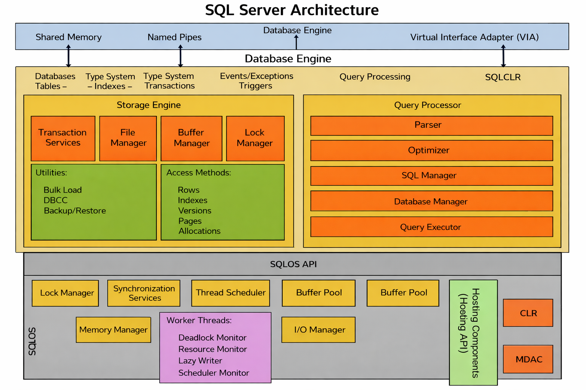

# What is SQL Server?

**SQL Server** is a **Relational Database Management System (RDBMS)** developed by **Microsoft** that is used to **store, manage, and retrieve structured data**. It allows users and applications to interact with databases using **Structured Query Language (SQL)**.

SQL Server is widely used in **enterprise systems, web applications, data analytics platforms, and business intelligence solutions** because it provides powerful features for **data storage, security, performance optimization, and scalability**.

In simple terms:

> SQL Server is software that stores data in databases and allows users or applications to retrieve and manipulate that data using SQL queries.

---

# How SQL Server Works

SQL Server uses a **client-server architecture**.

- The **SQL Server Database Engine** acts as the server that manages databases.
- **Clients** such as applications, APIs, or tools send SQL queries to the server.
- The server processes the query and returns the requested results.

Typical workflow:

1. A user or application sends a SQL query.
2. SQL Server processes the query.
3. The database engine retrieves or modifies the data.
4. Results are returned to the client.

---

# Key Components of SQL Server

## 1. Database Engine

The **Database Engine** is the core service of SQL Server. It is responsible for:

- Storing and managing data
- Processing SQL queries
- Managing transactions
- Handling authentication and security

---

## 2. Databases

A **database** is a structured collection of data stored in SQL Server.

Each database contains multiple objects such as:

- Tables
- Views
- Stored Procedures
- Functions
- Indexes
- Triggers

Example structure:
CompanyDatabase
├── Tables
│ ├── Employees
│ └── Departments
├── Views
├── Stored Procedures


---

## 3. Tables

Tables store data in a **structured format using rows and columns**.

Example table:

| EmployeeID | Name  | Department |
|------------|-------|------------|
| 1 | Alice | HR |
| 2 | Bob | IT |

Each row represents a **record**, and each column represents a **field**.

---

## 4. SQL Queries

SQL Server uses **SQL (Structured Query Language)** to interact with the database.

Example query:

```sql
SELECT Name, Department
FROM Employees
WHERE Department = 'IT';
```
This query retrieves employees who work in the IT department.

--- 

### SQL Server Architecture 
<div>
    
</div> 

SQL Server consists of two main components:

1. Database Engine
2. SQLOS


# SQL Server Database Engine

The **Database Engine** is the **core service of Microsoft SQL Server**. It is responsible for **storing, processing, and securing data**. When users or applications send SQL queries, the Database Engine processes those requests and returns the results.

The Database Engine consists of two main components:

- **Relational Engine (Query Processor)**
- **Storage Engine**

These components work together to process queries and manage data efficiently.

---

# Relational Engine (Query Processor)

The **Relational Engine**, also known as the **Query Processor**, is responsible for **processing SQL queries**. It determines the most efficient way to execute a query and retrieve the requested data.

### Main Responsibilities

- Parse SQL queries
- Validate query syntax
- Create an execution plan
- Optimize queries for performance
- Execute the query request

### How It Works

When a SQL query is submitted:

1. The query is **parsed** to check for syntax errors.
2. The query is **compiled**.
3. The **Query Optimizer** generates the most efficient execution plan.
4. The execution plan is sent to the **Storage Engine** to retrieve or modify data.

### Example Query

```sql
SELECT Name, Department
FROM Employees
WHERE Department = 'IT';
``

---

# SQLOS (SQL Server Operating System)

**SQLOS** stands for **SQL Server Operating System**. It is an internal layer inside SQL Server that manages system-level operations such as **memory management, scheduling, and I/O operations**.

SQLOS acts as a bridge between **SQL Server components and the Windows operating system**, allowing SQL Server to efficiently manage resources required for database operations.

### Responsibilities of SQLOS

SQLOS handles several important tasks:

- **Memory Management** – Allocates and manages memory used by SQL Server.
- **Task Scheduling** – Manages threads and schedules tasks for query execution.
- **I/O Management** – Handles reading and writing data to disk.
- **Deadlock Detection** – Identifies and resolves deadlocks between transactions.
- **Resource Management** – Ensures efficient use of CPU and system resources.

Because SQL Server manages many resources internally through SQLOS, it can **optimize database performance independently of the operating system**.

---

# SQL Server Services and Tools

SQL Server includes several **services and management tools** that help administrators and developers manage databases, automate tasks, and analyze data.

## SQL Server Services

SQL Server runs several background services to support database operations.

### SQL Server Database Engine Service

The **Database Engine Service** is the main service that stores, processes, and secures data.

Key functions:

- Manage databases
- Execute SQL queries
- Handle transactions
- Maintain data integrity

---

### SQL Server Agent

**SQL Server Agent** is used to **automate administrative tasks**.

It allows scheduling jobs such as:

- Database backups
- Running scripts
- Data maintenance
- Monitoring database performance

---

### SQL Server Browser

The **SQL Server Browser** service helps client applications **connect to SQL Server instances**, especially when multiple instances are running on the same server.

---

### SQL Server Integration Services (SSIS)

**SSIS** is used for **data integration and ETL (Extract, Transform, Load)** operations.

It helps move and transform data between different systems such as:

- Databases
- Data warehouses
- External files
- Cloud services

---

### SQL Server Reporting Services (SSRS)

**SSRS** is used to **create, manage, and deliver reports**.

It allows users to generate:

- Interactive reports
- Paginated reports
- Data visualizations

---

### SQL Server Analysis Services (SSAS)

**SSAS** provides **analytical and business intelligence capabilities**.

It is used for:

- Data modeling
- OLAP (Online Analytical Processing)
- Data analysis for business intelligence

---

# SQL Server Tools

SQL Server provides several tools for database development and administration.

## SQL Server Management Studio (SSMS)

**SSMS** is the primary graphical tool for managing SQL Server.

It allows users to:

- Create and manage databases
- Write and execute SQL queries
- Configure security
- Monitor server performance
- Manage backups and restores

---
